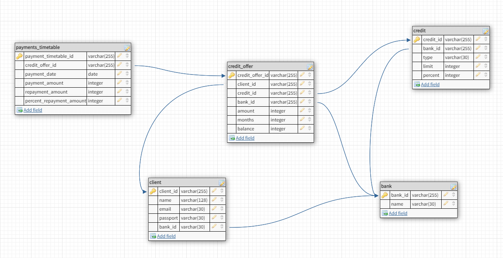
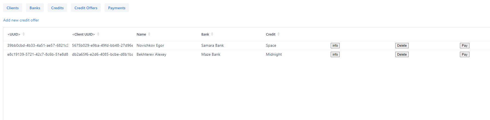
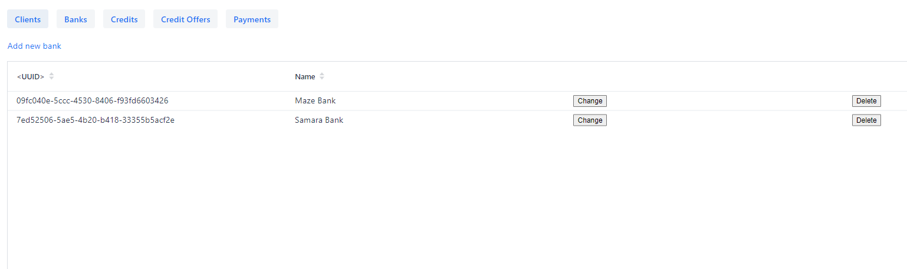
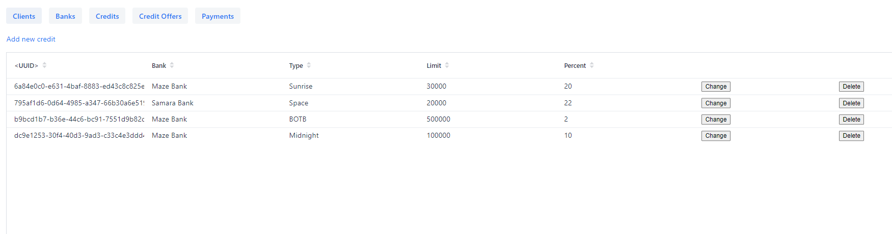
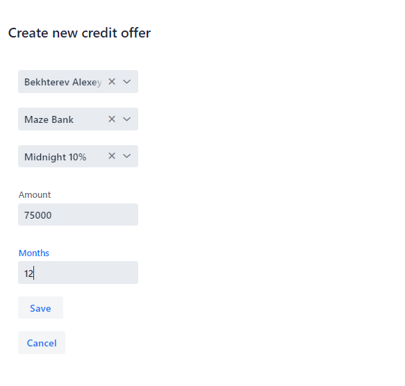
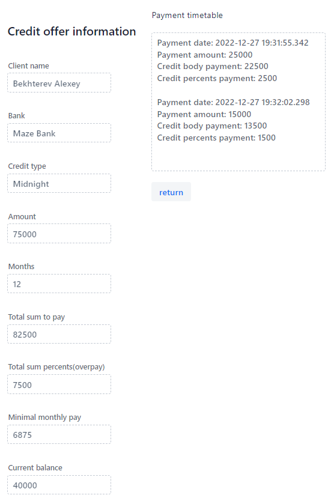
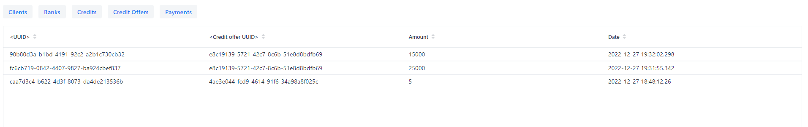

# ESA (2022) #
# Bekhterev Alexey, Novichkov Egor. Group 6133

# Practical Work #2 #
## Application using Spring Framework ##

### Subject Area
Для данной лабораторной работы мы выбрали тему простейшей банковской системы. Разработанное веб-приложение дает возможность добавлять клиентов, банки, кредиты для каждого банка, а также возможность пользователям взять кредит в определленном банке. 
Также клиент администратор системы имеет возможность добавить платеж по кредиту у клиента банка.

Также приложение позволяет произвести расчет итоговой суммы процентов по кредиту, а также сумму ежемесячного платежа с учетом процентной ставки.

### Data model
Модель данных включает следующие сущности:
- Клиент (ФИО, Электронная почта, Номер паспорта)
- Банк (Наименование, Список кредитов, Список клиентов)
- Кредит (Тип, Лимит по кредиту, Процентная ставка, Банк)
- Кредитное предложение (Клиент, Банк, Кредит, Сумма кредита, График платежей)
- График платежей (Кредитное предложение, Дата платежа, Сумма платежа, Сумма гашения тела кредита, Сумма гашения процентов)

Схема базы данных:

### Demo
#### Экраны с клиентами, банками и кредитами представлены в табличном виде
Клиенты

Банки

Кредиты

#### Экран создания кредитного предложения

#### Информацию о кредитном предложении можно получить из таблицы, нажав кнопку Info. В ней представлены данные о переплате за кредит, минимальной сумме платежа, а также текущем балансе и совершенных платежах.

#### Также в последней вкладке представлена таблица с платежами

# Practical Work #3 #
## RESTful web-service ##
Было реализовано REST API для получения списка платежей и произведения оплаты по кредиту, ответ приходит в виде json, либо xml, которые конвертируется в xslt

# Practical Work #4 #
## Java Message Service ##
 
Были созданы 2 доп таблицы - Логгирование и История емейлов, которые используются для хранения информации об изменении сущности creditOffer,
а также об "отправленных" письмах об этих изменениях. Для реализации был использован AOP подход, тк данная логика независит от бизнес-логики.
Для этого был реализован класс AspectLogging, который по отслеживая сервисы по определенному пути отлавилвает исполнение методов помеченных аннотацией @Loggable,
а затем выполняет отправку сообщения. Данное сообщение содержит необходимую для 2 таблиц информацию. Эти сообщения перехватывают JmsListener'ы которые в свою очередь сохраняют данные об изменениях в бд и производят логгирование.

